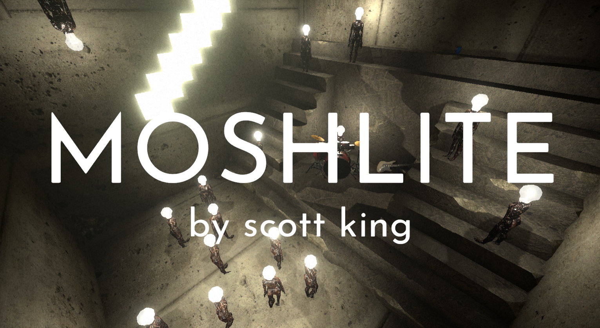

# MOSHLITE

scottking.itch.io/moshlite

MOSHLITE is a visual instrument, an experiment in unique interactions, and a basement show at the end of the world. 
Developed for 60-419 at CMU taught by Professor Paolo Pedercini and exhibited at Games Premiere 2022. 

## Controls

MOSHLITE is configured to be controlled by a Roland TD-25KV electronic drumset but keyboard controls for demonstration and testing are listed below.  

### Drums
Ride: Camera controls
- Edge (u): cut to random
- Bow (j): Pan to random
- Bell (i): cut to previous

Left Crash: Camera FX
- Edge (f): Shake cam
- Bow (d): Toggle fisheye + intense shaking effect

Right Crash: Lighting FX
- Edge (t): Toggle lights on/off
- Bow (y): Light flickering effect

Hi-hat: Moshing
- Open edge (c): Dancing
- Open Bow (v): Random moshing (jumping, head banging, dancing, etc)
- Closed bow (x): Mosh towards center of pit 
- Pedal close (z): Reset visual effects (water color, red, shaky cam, lights off, etc)

Snare
- Head (b): Jump
- Rim (a): Watercolor effect toggle

Kick (space)
- Random moshing (jumping, head banging, dancing, etc)

Tom1: Color PP effects
- Head (g): Toggle red effect
- Rim (q): Toggle weird color effect

Tom2: Gravity effects
- Head (h): Gravity singularity effect
- Rim (w): Toggle gravity on and off

Tom3: Various effects
- Head (n): Bang heads
- Rim (e): Scale pulse effect

### Keyboard
- R: reset scene
- Esc: exit application
- LMB: start from title screen

## Attributions:
- "Minis" unity package  
	(https://github.com/keijiro/Minis) by Keijiro is under Public Domain, 
	bu relies on RtMidi, which is licensed under an MIT-style license (https://github.com/keijiro/jp.keijiro.rtmidi/blob/master/LICENSE)
- "Obi Rope" unity asset  
	(https://assetstore.unity.com/packages/tools/physics/obi-rope-55579) by Virtual Method, purchased license for personal and commercial use
- "Blender Stairs" Blender add-on used to create stairs   
	(https://github.com/blackears/blenderStairs) by blackears
- "OCD (One Click Damage)" blender add-on  
	(https://blendermarket.com/products/ocd) by vfxguide, purchased license for personal and commercial use 
- "Concrete" textures  
	(https://polyhaven.com/a/concrete) by Rob Tuytel is licensed under Creative Commons 0
- "Brushed Concrete" textures  
	(https://polyhaven.com/a/brushed_concrete) by Dario Barresi and Dimitrios Savva is licensed under Creative Commons 0
- "Concrete Floor 02" textures  
	(https://polyhaven.com/a/concrete_floor_02) by Rob Tuytel is licensed under Creative Commons 0
- "Concrete Wall 006" textures  
	(https://polyhaven.com/a/concrete_wall_006) by Charlotte Baglioni and Dario Barresi is licensed under Creative Commons 0
- "FNaF | Loud Speaker" model  
	(https://skfb.ly/6UCBI) by Glitch5970 is licensed under Creative Commons Attribution (http://creativecommons.org/licenses/by/4.0/).
- "Old amp" model   
	(https://skfb.ly/onSEH) by pibanezl is licensed under Creative Commons Attribution (http://creativecommons.org/licenses/by/4.0/).
- "RCA 44-BX Microphone" model  
	(https://skfb.ly/6AKHx) by Tom Seddon is licensed under Creative Commons Attribution (http://creativecommons.org/licenses/by/4.0/).
- "Garbage heep" model  
	(https://www.cgtrader.com/free-3d-models/exterior/street-exterior/garbage-heep) by djkorg is licensed under a royalty free license
- "Trash Soda Cans and Tins" model  
	(https://www.cgtrader.com/free-3d-models/food/beverage/trash-soda-cans-and-tins) by jon-knutton
- "Bass Guitar Low Poly Freebie" model  
	(https://skfb.ly/6SPER) by Geug is licensed under Creative Commons Attribution (http://creativecommons.org/licenses/by/4.0/).
- "Microphone" model   
	(https://skfb.ly/Kzvy) by anathlyst is licensed under Creative Commons Attribution (http://creativecommons.org/licenses/by/4.0/).
- "Worn out vintage Fender Stratocaster guitar" model  
	(https://skfb.ly/oxXZU) by kiksart is licensed under Creative Commons Attribution (http://creativecommons.org/licenses/by/4.0/).
- "Guitar Pedal" model   
	(https://skfb.ly/6sJqZ) by Pau is licensed under CC Attribution-NonCommercial-NoDerivs (http://creativecommons.org/licenses/by-nc-nd/4.0/).
- "Drum Set" model  
	(https://skfb.ly/ounBz) by Rohit Paradkar is licensed under Creative Commons Attribution (http://creativecommons.org/licenses/by/4.0/).
- "JosefinSans" font  
	(fonts.google.com/specimen/Josefin+Sans) by Santiago Orozco is licensed under the Open Font License included in this repo
- "Noto Sans Japanese" font  
	(https://fonts.google.com/noto/specimen/Noto+Sans+JP/tester) is licensed under the Open Font License included in this repo 
- "Kino Aqua" post-processing effect  
	(https://github.com/keijiro/KinoAqua) by Keijiro Takahashi is licensed under the unlicense (https://github.com/keijiro/KinoAqua/blob/main/LICENSE)
